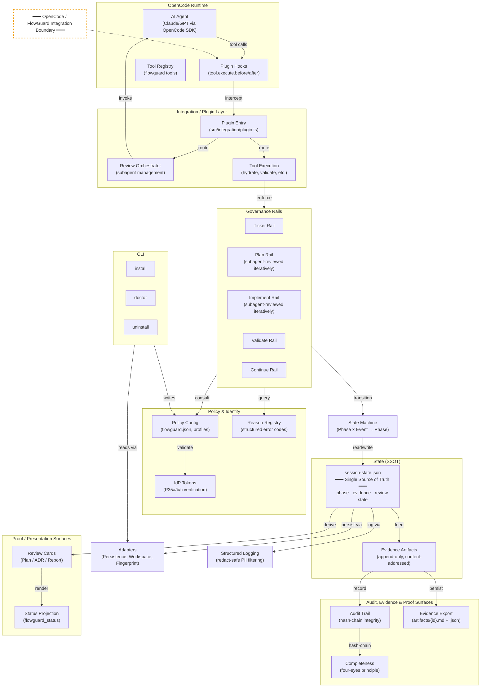

# FlowGuard Architecture

## Layered Architecture



## Three Governed Flows

From `READY`, three flows are available:

### 1. Ticket Flow (Full Development Lifecycle)

```
READY → TICKET → PLAN ⇄ PLAN_REVIEW → VALIDATION → IMPLEMENTATION ⇄ IMPL_REVIEW → EVIDENCE_REVIEW → COMPLETE
```

- `/task` → `/plan` → `/approve` → `/check` → `/implement` → `/approve`
- Subagent review loops at PLAN and IMPLEMENTATION for iterative convergence
- User gates at PLAN_REVIEW, EVIDENCE_REVIEW (human approval required)
- Self-review never accepted as evidence — mandatory independent subagent attestation

### 2. Architecture Flow (ADR)

```
READY → ARCHITECTURE ⇄ ARCH_REVIEW → ARCH_COMPLETE
```

- `/architecture` → `/approve`
- MADR-format ADR with independent subagent review
- Fail-closed: `unable_to_review` verdict blocks at all layers

### 3. Review Flow (Standalone)

```
READY → REVIEW → REVIEW_COMPLETE
```

- `/review` — content-aware (PR, branch, text, URL)
- Obligation-bound: each `/review` creates a `ReviewObligation`

## Key Design Principles

- **Fail-closed:** Default deny. Every decision must be explicitly approved.
- **SSOT:** `session-state.json` is the single source of truth — no derived state acts as authority.
- **Hash-chain audit:** Every state transition is cryptographically linked; tampering is detectable.
- **Immutable artifacts:** Evidence is persisted as content-addressed files in `artifacts/`.
- **Presentation ≠ Authority:** Review cards and status output are derived views — never read back as runtime state.
