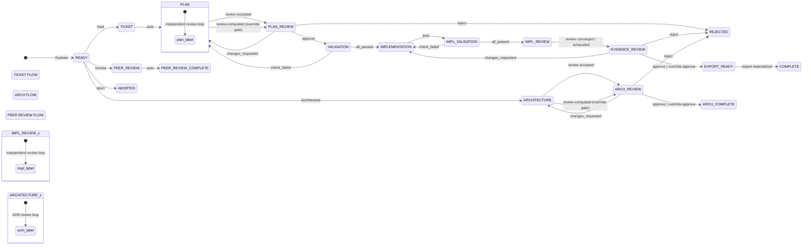

# Phases

FlowGuard uses 18 explicit workflow phases across 3 independent flows. Every session starts at the **READY** phase after `/hydrate`, with 4 transitions from READY: the three flow selections plus emergency `/abort`.

## Flows

### Ticket Flow (Full Development Lifecycle)

```
READY → TICKET → PLAN → PLAN_REVIEW → VALIDATION → IMPLEMENTATION → IMPL_VALIDATION → IMPL_REVIEW → EVIDENCE_REVIEW → EXPORT_READY → COMPLETE
```

### Architecture Flow (ADR Creation)

```
READY → ARCHITECTURE → ARCH_REVIEW → ARCH_COMPLETE
```

### Peer Review Flow

```
READY → PEER_REVIEW → PEER_REVIEW_COMPLETE
```

## Flow Diagram



| Symbol                    | Meaning                                                                              |
| ------------------------- | ------------------------------------------------------------------------------------ |
| `■`                       | Terminal phase (session complete, `/archive` available)                              |
| `◄` / `►`                 | Backward transition (changes_requested / reject / CHECK_FAILED)                      |
| `independent review loop` | Separate reviewer subagent reviews output iteratively (digest-stop / max iterations) |
| `auto`                    | Automatic transition without user intervention                                       |

## Phase Reference

### Shared Entry Point

| Phase    | Description                             | Gate Type      |
| -------- | --------------------------------------- | -------------- |
| READY    | Post-hydrate entry point, choose a flow | Command-driven |
| ABORTED  | Session terminated by `/abort`          | Terminal       |
| REJECTED | Human gate rejected                     | Terminal       |

### Ticket Flow

| Phase           | Description                                 | Gate Type                      |
| --------------- | ------------------------------------------- | ------------------------------ |
| TICKET          | Record task description                     | Automatic                      |
| PLAN            | Generate plan + independent subagent review | Automatic (independent review) |
| PLAN_REVIEW     | Human approves plan                         | **User Gate**                  |
| VALIDATION      | Run validation checks                       | Automatic                      |
| IMPLEMENTATION  | Execute plan                                | Automatic                      |
| IMPL_VALIDATION | Re-run checks against the implemented code  | Automatic                      |
| IMPL_REVIEW     | Subagent reviews implementation             | Automatic (independent review) |
| EVIDENCE_REVIEW | Human reviews evidence                      | **User Gate**                  |
| EXPORT_READY    | Materialize verifiable export evidence      | Command-driven                 |
| COMPLETE        | Session complete                            | Terminal                       |

### Architecture Flow

| Phase         | Description              | Gate Type              |
| ------------- | ------------------------ | ---------------------- |
| ARCHITECTURE  | Create ADR + review loop | Automatic (ADR review) |
| ARCH_REVIEW   | Human reviews ADR        | **User Gate**          |
| ARCH_COMPLETE | ADR accepted             | Terminal               |

### Peer Review Flow

| Phase                | Description                               | Gate Type |
| -------------------- | ----------------------------------------- | --------- |
| PEER_REVIEW          | Review a foreign target, no approver gate | Automatic |
| PEER_REVIEW_COMPLETE | Peer review report delivered              | Terminal  |

## Gate Types

### Command-Driven (READY)

- User selects a flow via command (`/task`, `/architecture`, `/review`)
- No guards — evaluator returns `pending` until a command is issued

### Automatic Gates

- No human intervention required
- Machine evaluates state and advances
- Examples: TICKET → PLAN, VALIDATION → IMPLEMENTATION

### Independent Review Gates

- A separate reviewer subagent reviews plan and implementation output iteratively
- Convergence via digest-stop (output unchanged) or max iterations from policy
- Examples: PLAN, IMPL_REVIEW

### User Gates

- Require an explicit human decision: `/approve`, `/request-changes`, or `/reject`
- An exhausted review loop turns the gate into a **governance override gate**:
  plain `/approve` is blocked (`GOVERNANCE_OVERRIDE_REQUIRED`) and the only
  approval path is `/override-approve`, which records the override and binds the
  exact reviewed subject digest
- Four-eyes principle in regulated mode (reviewer must differ from session initiator)
- Examples: PLAN_REVIEW, EVIDENCE_REVIEW, ARCH_REVIEW

## Phase Details

### READY

**Entry:** `/hydrate`
**Exit:** `/task`, `/architecture`, or `/review`

Post-hydrate entry point. The system provides guidance on available flows. User selects a flow by issuing the corresponding command.

### TICKET

**Entry:** `/task` from READY
**Exit:** Automatic (advances to PLAN when ticket evidence is recorded)

Records the task description. Validates that the task is clear and actionable.

### PLAN

**Entry:** From TICKET
**Exit:** Automatic (independent review convergence advances to PLAN_REVIEW)

Generates an implementation plan and requires independent subagent review before
the plan can advance. The reviewer subagent returns one of three verdicts:
`approve`, `changes_requested`, or `unable_to_review`. The first two drive
normal loop progression. `unable_to_review` consumes the obligation and BLOCKS
via `SUBAGENT_UNABLE_TO_REVIEW` — the agent must produce a substantively-new
plan to start a fresh obligation. See `docs/independent-review.md`.

### PLAN_REVIEW

**Entry:** Automatic from PLAN (independent review accepted or exhausted)
**Exit:** `/approve`, `/override-approve`, `/request-changes`, or `/reject`

Human reviews and approves the plan before implementation begins. When independent review converges, a **Plan Review Card** is displayed showing the complete plan body, version, policy mode, task title, and recommended next actions. In regulated mode, a second person must review.

- `approve` → VALIDATION (reviewer accepted the reviewed revision)
- `override-approve` → VALIDATION (review exhausted without acceptance; recorded as a governance override bound to the reviewed digest)
- `changes_requested` → back to PLAN
- `reject` → REJECTED (terminal)

### VALIDATION

**Entry:** `/approve` or `/override-approve` from PLAN_REVIEW
**Exit:** Automatic (all checks passed → IMPLEMENTATION, any check failed → back to PLAN)

Runs automated validation checks derived from `verificationCandidates`. All checks must pass to proceed.
Validation executes automatically when the phase is entered; `/check` remains available as a compatibility surface to execute the active verification candidates explicitly.

### IMPLEMENTATION

**Entry:** Automatic from VALIDATION (all checks passed)
**Exit:** Automatic (auto-advances to IMPL_VALIDATION)

AI implements the plan using OpenCode tools. Changed files are automatically tracked via git.

When `policy.allowReducedCeremony` is enabled, FlowGuard may reduce only the implementation-review ceremony after implementation evidence is recorded. The machine still uses explicit transitions (`IMPLEMENTATION → EVIDENCE_REVIEW` via `REDUCED_CEREMONY`, then the normal evidence gate). Reduction is evidenced in `state.reducedCeremony`; FlowGuard does not synthesize `implReview` evidence. Reduction is allowed only for a `TRIVIAL` claim, runtime-computed `TRIVIAL` changed files, clear `riskGate`, complete passing validation evidence, no sensitive surfaces, no policy-required host review, and no outstanding review obligation. Otherwise the full IMPL_VALIDATION → IMPL_REVIEW path remains unchanged.
Use `/implement` to record evidence and auto-advance.

### IMPL_VALIDATION

**Entry:** Automatic from IMPLEMENTATION (after `/implement` records evidence)
**Exit:** Automatic (all post-fix checks passed → IMPL_REVIEW; any check failed → back to IMPLEMENTATION)

Re-runs the active verification checks against the **implemented** code (recorded in
`implValidation`, distinct from the pre-implementation `validation` baseline). The
checks execute automatically; `/check` remains available as a compatibility surface to
execute them explicitly. A genuine failure routes back to IMPLEMENTATION (the
delivered code is wrong, not the plan); a timeout or executor error retries in
IMPL_VALIDATION without invalidating the approved plan. Reduced ceremony bypasses this
phase along with IMPL_REVIEW.

### IMPL_REVIEW

**Entry:** Automatic from IMPL_VALIDATION (post-implementation checks passed)
**Exit:** Automatic (review convergence)

The reviewer subagent reviews the implementation against the plan. This is an
**independent review gate, not a human gate** (USER_GATES = {PLAN_REVIEW,
EVIDENCE_REVIEW, ARCH_REVIEW}). The LLM records evidence with `flowguard_implement` and submits the reviewer verdict via
`flowguard_review_implementation`. The reviewer's three verdicts
(`accept`, `changes_requested`, `unable_to_review`) follow the same semantics
as the PLAN loop. On `accept` convergence, auto-advances to EVIDENCE_REVIEW;
on `unable_to_review`, BLOCKED via `SUBAGENT_UNABLE_TO_REVIEW`.

### EVIDENCE_REVIEW

**Entry:** Automatic from IMPL_REVIEW (review converged or exhausted)
**Exit:** `/approve`, `/override-approve`, `/request-changes`, or `/reject`

Final human review of all evidence before completion. When the implementation
review exhausted its budget with changes requested, this gate becomes a
governance override gate: plain `/approve` is blocked and the reviewed revision
can only be accepted through `/override-approve`, which binds the exact
reviewed implementation digest.

- `approve` → EXPORT_READY (reviewer accepted the reviewed revision)
- `override-approve` → EXPORT_READY (review exhausted; recorded override)
- `changes_requested` → back to IMPLEMENTATION
- `reject` → REJECTED (terminal)

### EXPORT_READY

**Entry:** `/approve` or `/override-approve` from EVIDENCE_REVIEW
**Exit:** `/export` (materializes the verifiable package and completes)

Completion is possible only after `/export` materializes and persists exact,
verifiable export evidence. A blocked or failed export leaves the session in
EXPORT_READY; only `EXPORT_MATERIALIZED` advances to COMPLETE.

### COMPLETE

**Entry:** Automatic after `/export` materializes and persists verifiable export evidence
**Exit:** Terminal

Ticket flow complete. Can be archived with `/archive`.

### ARCHITECTURE

**Entry:** `/architecture` from READY (or re-entry after `changes_requested` at ARCH_REVIEW)
**Exit:** Automatic (ADR review convergence advances to ARCH_REVIEW)

Creates an Architecture Decision Record (ADR) in MADR format. The ADR must
include `## Context`, `## Decision`, and `## Consequences` sections. The ADR
review loop runs through the **same plugin-orchestrated subagent pipeline** as
PLAN and IMPL_REVIEW (F13 parity): the reviewer evaluates Context completeness,
Decision concreteness, Consequences honesty, and MADR structure. Three
verdicts (`accept`, `changes_requested`, `unable_to_review`) follow uniform
semantics; `unable_to_review` consumes the obligation and BLOCKS via
`SUBAGENT_UNABLE_TO_REVIEW`.

### ARCH_REVIEW

**Entry:** Automatic from ARCHITECTURE (ADR review accepted or exhausted)
**Exit:** `/approve`, `/override-approve`, `/request-changes`, or `/reject`

Human reviews the ADR. An exhausted ADR review turns this gate into a
governance override gate; the override binds the exact reviewed ADR digest.

- `approve` → ARCH_COMPLETE (ADR status set to "accepted")
- `override-approve` → ARCH_COMPLETE (review exhausted; recorded override)
- `changes_requested` → back to ARCHITECTURE
- `reject` → REJECTED (terminal)

### ARCH_COMPLETE

**Entry:** Automatic after ARCH_REVIEW approval
**Exit:** Terminal

Architecture flow complete. ADR is accepted. MADR artifact is written. Can be archived with `/archive`.

### PEER_REVIEW

**Entry:** `/review` from READY
**Exit:** Automatic (report generation advances to PEER_REVIEW_COMPLETE)

The peer review flow reviews a foreign PR, branch, commit, diff, or text and
produces findings for another developer. It never mutates the reviewed target
and has no approval gate; `changes_requested` is a valid review outcome, not a
workflow instruction.

### PEER_REVIEW_COMPLETE

**Entry:** Automatic from PEER_REVIEW (report generated)
**Exit:** Terminal

Peer review complete. Report delivered. Can be archived with `/archive`.
